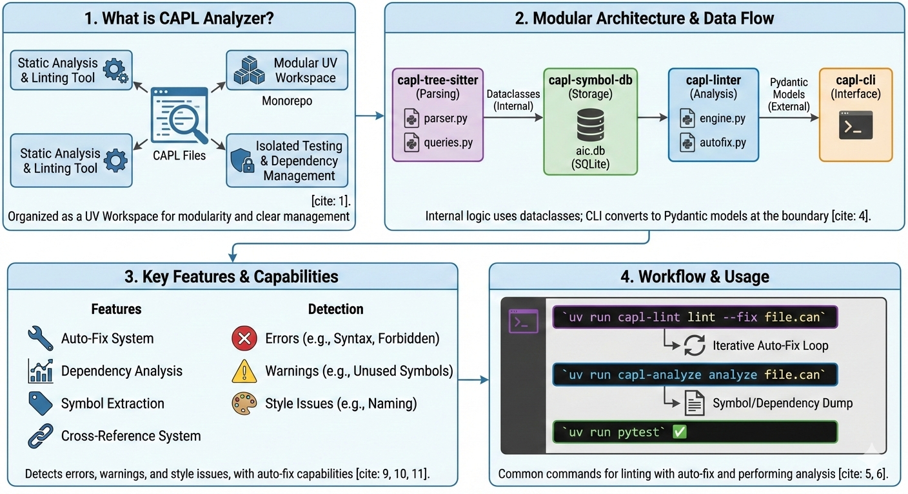

# CAPL Analyzer (capllint)

> Static analysis and linting tools for CAPL (CANoe/CANalyzer Programming Language)

[](https://www.python.org/downloads/)
[](https://opensource.org/licenses/MIT)
[](https://pypi.org/project/capllint/)



## 🚀 Features

- **Code Formatting**: Professional AST-based formatting (Ruff/Black style) for CAPL files.
- **Auto-Fix System**: Automatically resolves common linting issues with rule-specific fix logic.
- **Dependency Analysis**: Track `#include` relationships and build transitive visibility graphs.
- **Symbol Extraction**: Extract functions, parameters, event handlers, and enum members.
- **Cross-Reference System**: Find all references to any symbol across your codebase.
- **Static Analysis / Linter**: Detect common issues and enforce coding standards across multiple files.
- **Configuration Support**: Customize behavior via `.capl-lint.toml`.

## 💅 Formatting

The `capllint format` command provides highly stable, idempotent formatting for CAPL, inspired by modern tools like Ruff and Black.

### Core Features

- **AST-Based Precision**: Uses `tree-sitter-c` to understand code structure, ensuring formatting never breaks logic.
- **Context-Aware Vertical Spacing**: 
    - **Setup Zone**: Automatically compresses local variable declarations at the start of blocks for a clean "header" look.
    - **Logic Zone**: Preserves developer-intended blank lines between functional statements.
    - **Boundary Cleanup**: Removes redundant blank lines at the start and end of blocks.
- **Top-Level Reordering** (Optional): Enforces a standardized architectural hierarchy:
    1. `includes` blocks.
    2. `variables` blocks (Global scope).
    3. `testcase` definitions (preserving relative order).
    4. Event handlers (`on message`, `on start`, etc.) sorted alphabetically.
    5. User functions sorted alphabetically.
- **Modern Standards**: Enforces K&R brace style, intelligent operator spacing, and consistent quote usage.

### Usage

```bash
# Format specific files or directories in-place
uv run capllint format MyNode.can src/

# Check for violations without modifying (CI mode)
uv run capllint format --check .

# Output results in JSON format
uv run capllint format --json .
```

### Configuration

Customize the formatter via `.capl-format.toml`:

```toml
[tool.capl-format]
indent-size = 2
line-length = 100
brace-style = "k&r"
quote-style = "double"
reorder-top-level = true  # Standardize architectural order
```

## 📋 What Can It Detect?

### Errors
- ❌ Variables declared outside `variables {}` block
- ❌ Local variables declared after executable statements (mid-block)
- ❌ Undefined symbol references (with transitive include support and CAPL built-ins)
- ❌ Duplicate function definitions (across project)
- ❌ Circular include dependencies
- ❌ Missing `enum` or `struct` keywords in declarations
- ❌ Forbidden syntax: function forward declarations
- ❌ Forbidden syntax: `extern` keyword usage
- ❌ Forbidden syntax: arrow operator `->` (must use dot `.`)
- ❌ Forbidden syntax: struct pointers in parameters

### Warnings
- ⚠️ Unused variables, functions, messages, and timers
- ⚠️ Timers set without handlers

## 🔧 Installation

### From PyPI (Recommended)

```bash
pip install capllint
# or with uv
uv tool install capllint
```

### Local Development

```bash
# Clone the repository
git clone https://github.com/MohamedHamed19m/CAPL_Linter.git
cd CAPL_Linter

# Install dependencies
uv sync

# Run the linter
uv run capllint lint MyNode.can
```

## 🏗️ Project Structure

The project is organized as a single package with internal modules:

- **`capllint`** (Root): User-facing CLI built with `typer`.
- **`src/capl_tree_sitter`**: Core CAPL parsing using tree-sitter.
- **`src/capl_symbol_db`**: Symbol extraction and persistent storage (SQLite).
- **`src/capl_linter`**: Analysis engine and auto-fix logic.
- **`src/capl_formatter`**: AST-based code formatter.

```
CAPL_Linter/
├── src/
│   ├── capl_cli/          # CLI source
│   ├── capl_tree_sitter/  # Parser layer
│   ├── capl_symbol_db/    # Database and extraction
│   ├── capl_linter/       # Analysis and rules
│   └── capl_formatter/    # Code formatting
├── tests/                 # Unit and integration tests
├── examples/
├── docs/
├── pyproject.toml         # Consolidated package configuration
└── README.md
```

## 🧪 Running Tests

```bash
# Run all tests
uv run pytest

# Run tests for a specific module
uv run pytest src/capl_linter/
uv run pytest src/capl_formatter/

# Run with coverage report
uv run pytest --cov-report=html
```

## 🤝 Contributing

Contributions are welcome! Please feel free to submit a Pull Request.

1. Fork the repository
2. Create your feature branch (`git checkout -b feature/AmazingFeature`)
3. Commit your changes (`git commit -m 'Add some AmazingFeature'`)
4. Push to the branch (`git push origin feature/AmazingFeature`)
5. Open a Pull Request

## 📝 License

This project is licensed under the MIT License - see the LICENSE file for details.

## 🙏 Acknowledgments

- Built with [tree-sitter](https://tree-sitter.github.io/tree-sitter/) for robust parsing
- Inspired by modern linting tools and static analyzers

## 🐛 Known Issues & Roadmap

- [ ] Add support for CAPL 2.0+ features
- [ ] Implement more sophisticated control flow analysis
- [ ] Add auto-fix capabilities for style issues
- [ ] Build VS Code extension
- [ ] Add configuration file support (.capl-lint.toml)
- [ ] **Formatter**: Implement advanced "Chop-down" line wrapping for complex arguments
- [ ] **Formatter**: Enforce semantic style (e.g., standardizing Hex casing `0x1A`)

## 💬 Support

If you have any questions or run into issues, please [open an issue](https://github.com/MohamedHamed19m/CAPL_Linter/issues).